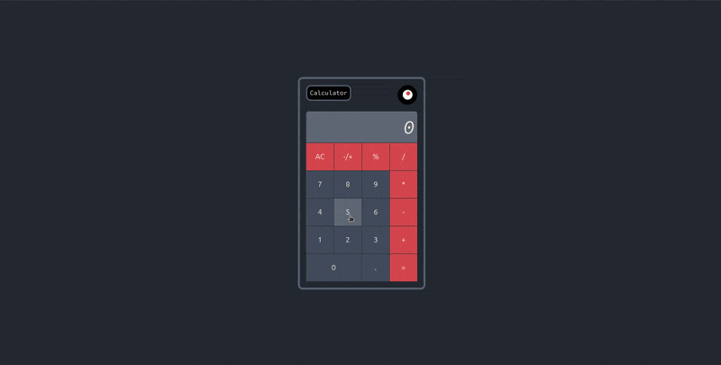

# Calculator
This is a simple calculator project with basic operations. And with conversion of the number into percent or negative variants.

**Link to project:** https://defalterxd.github.io/Calculator/

## How It's Made:

*Tech used:** HTML, CSS, JavaScript

This project can be separate into two phases:
<ol>
  <li>Setting up the calculator layout<li>
  <li>Adding core functionality of calculator<li>
</ol>

In the first phase, there was complications regarding the flex layout and how to make all the button be like the grid scheme. With different versions of how the buttons need to be placed.

After that in the second phase goes implementation of core functionality:

<ul>
  <li>Getting input from the buttons and view it on the output screen</li>
  <li>Adding the basic operations with two number and view the result</li>
  <li>Check and implement the self expression depending if the operation button was pressed twice</li>
  <li>Implementing the other operations altering the input number like: percent conversion and negative/positive conversion</li>
  <li>Adjust input for a number so it could be turn into decimal</li>
  <li>Checking the edge cases of result of the expression where the number goes into 'Infinity' value</li>
  <li>The most easier implementation of the 'all clear' button</li>
  <li>And last adding the keyboard support</li>
</ul>

## Optimization:

In this project optimization was mostly only re-made the block of code into re-usable function and implementing checking function for 'Infinity' value of the number. 
Making the result of the expression not overflowing inside the container limiting this into length of 9 digits. And checking the decimal number to place it's decimal point to the corresponding place depending how big is integer part.
The most struggling optimization was for converting into percent equivalent the result of expression, so in code there another variable to hold the previous result of expression to use it to converting it into the percent decimal.
And the last tweaks was for putting decimal into input field, checking for the number to put the decimal point or not.

## Lessons Learned:

In this project I learned:

<ul>
  <li>How to use array for getting input numbers</li>
  <li>Manipulate an array to use it for converting input number into actual numbers</li>
  <li>Utilizing array methods for operations sequences</li>
  <li>Using new method of 'Math' object for edge cases</li>
  <li>Implementing keyboard support through different event listener</li>
</ul>

## References:

Theme I used for calculator - 'Bushido'